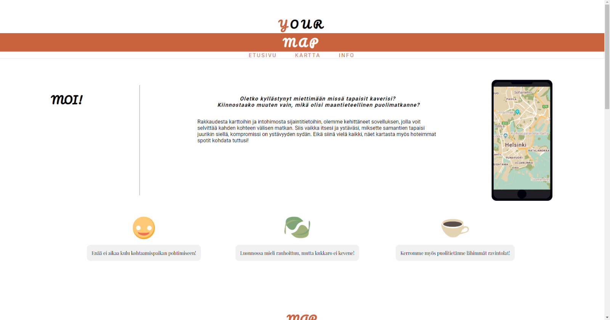
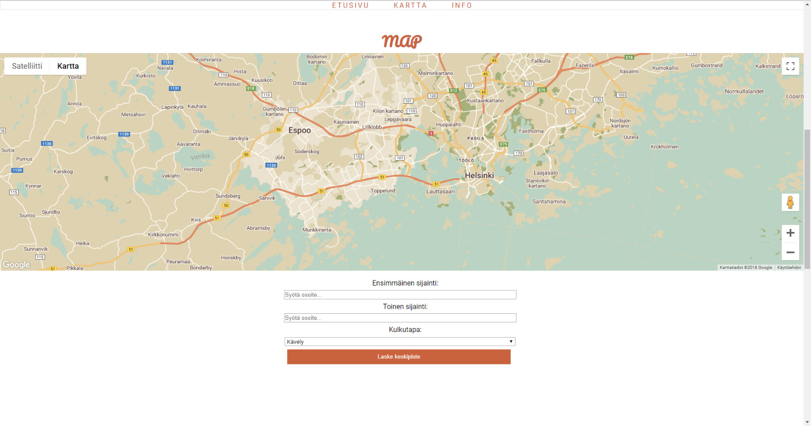
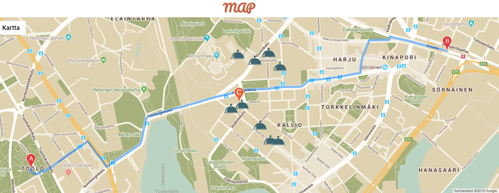

<h1>Yourmap</h1>

Ensimmäinen web-projekti, joka on tehty ryhmätyönä. Käyttäjä pystyy syöttämään kaksi eri osoitetta, ja kartalle ilmestyy näiden pisteiden puoliväli. Lisäksi kartalla näkyy puolivälin lähellä olevat kahvilat/ravintolat. Käyttäjä voi itse valita kulkutavan, ja välimatkan suuruus ilmestyy ruudulle. Sovellusta voi hyödyntää vaikka kaverukset, joilla on vaikeuksia löytää molemmille sopivaa tapaamispaikkaa.

Käytetyt tekniikat:
- HTML
- CSS
- JavaScript
- Google Maps API(s)

Oma työnjälkeni näkyy kartan toiminnoissa.

Web-app that has been made as a group-project. User can insert two addresses and the app will show their midpoint. Also you can see restaurants/cafes that are near midpoint. App is perfect for friends who want to know and meet at their midpoint. That way the (geographical) distance is same for both. 

Used techniques:
- HTML
- CSS
- JavaScript
- Google Maps API(s)

I have made a large proportion of the map functions.
